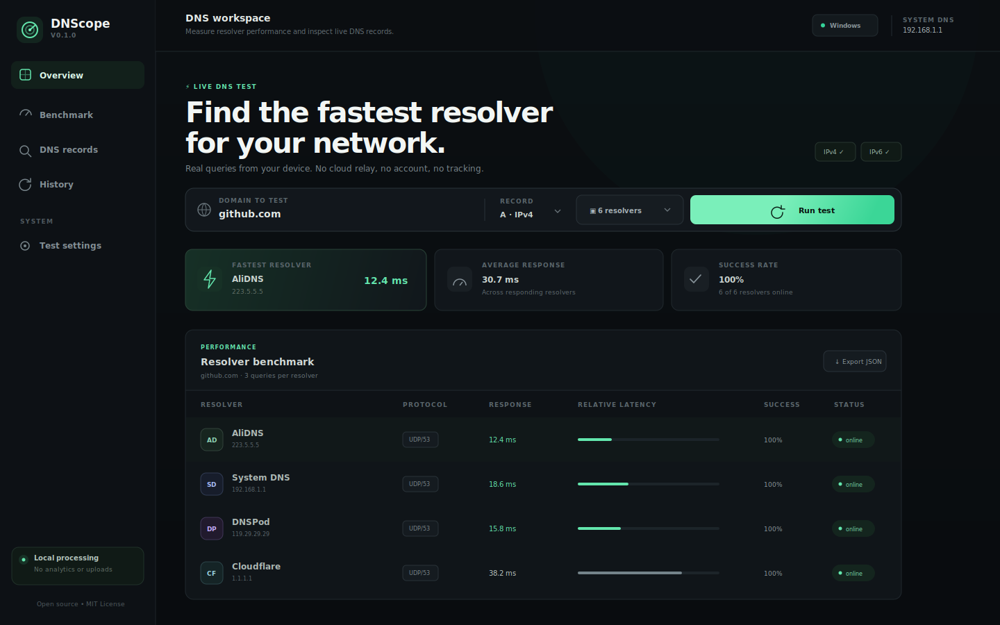
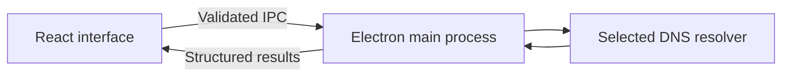

# DNScope

<p align="center">
  
</p>

<p align="center">
  A fast, privacy-first desktop DNS benchmark and record inspector.
</p>

<p align="center">
  <a href="https://github.com/hhhoratioxu/DNScope/actions/workflows/ci.yml"></a>
  <a href="LICENSE"></a>
  
</p>



DNScope sends real DNS queries directly from your computer, compares selected
resolvers, and shows the records each resolver returned. There is no account,
cloud relay, advertising, or analytics.

## Features

- Benchmark A and AAAA lookups over standard UDP DNS.
- Compare system DNS, AliDNS, DNSPod, Cloudflare, Google Public DNS, and Quad9.
- Add custom IPv4 or IPv6 resolvers.
- Measure average, median, minimum, maximum, jitter, and success rate.
- Inspect A, AAAA, CNAME, and TTL values.
- Export a complete JSON report.
- Keep a small, device-local test history.
- Secure Electron boundary with context isolation, sandboxing, and a narrow IPC API.

> [!IMPORTANT]
> Version 0.1 uses classic UDP DNS on port 53. These queries are not encrypted.
> DoH, DoT, and DoQ support are planned for future releases.

## Download

Every push to `main` builds a Windows installer in the repository's **Actions →
CI → Artifacts** section. Tagged versions are automatically published for
Windows, macOS, and Linux on the **Releases** page.

Unsigned early builds can trigger an operating-system warning. Verify that the
download came from this repository before running it.

## Run from source

Requirements: Node.js 24 or newer and npm.

```bash
git clone https://github.com/hhhoratioxu/DNScope.git
cd DNScope
npm install
npm run dev
```

Useful commands:

```bash
npm run check      # tests + production frontend build
npm run dist:win   # Windows NSIS installer
npm run dist:mac   # macOS DMG
npm run dist:linux # Linux AppImage
```

## How it works

The React renderer never receives Node.js access. It sends validated requests
through a small preload bridge; the Electron main process creates isolated
`node:dns` resolvers, measures each query, and returns serializable results.



## Privacy

DNScope does not collect or upload telemetry. Test history stays in local
application storage. DNS requests still reach the resolver you select and may
be visible to your network operator because v0.1 uses unencrypted UDP DNS.

## Roadmap

- [ ] DNS-over-HTTPS (DoH)
- [ ] DNS-over-TLS (DoT)
- [ ] DNS-over-QUIC (DoQ)
- [ ] DNSSEC validation
- [ ] HTTPS/SVCB records, HTTP/3, and ECH hint inspection
- [ ] Historical charts and comparison profiles
- [ ] Chinese interface

Issues and focused pull requests are welcome. Please read [CONTRIBUTING.md](CONTRIBUTING.md)
and [SECURITY.md](SECURITY.md) before contributing.

---

# 中文说明

DNScope 是一款快速、注重隐私的桌面 DNS 测速与解析记录检查工具。它直接从你的电脑向所选 DNS
服务器发送真实查询，不经过云端中转，也不包含账号、广告或数据分析功能。

## 主要功能

- 测试 A（IPv4）与 AAAA（IPv6）解析速度。
- 内置系统 DNS、AliDNS、DNSPod、Cloudflare、Google Public DNS 与 Quad9。
- 支持添加自定义 IPv4 或 IPv6 DNS 服务器。
- 显示平均值、中位数、最低值、最高值、抖动和成功率。
- 查看 A、AAAA、CNAME 记录与 TTL。
- 导出完整 JSON 检测报告。
- 最近检测历史仅保存在本机。
- Electron 启用上下文隔离和沙箱，网页界面无法直接访问 Node.js。

> [!IMPORTANT]
> 0.1 版本目前使用 UDP 53 端口的传统 DNS，查询内容没有加密。DoH、DoT、DoQ
> 将在后续版本中加入。

## 下载与运行

每次代码推送到 `main` 后，GitHub Actions 都会自动生成 Windows 安装程序，可在仓库的
**Actions → CI → Artifacts** 中下载。带版本标签的正式版本会自动发布 Windows、macOS 和
Linux 安装包。

本地开发需要 Node.js 24 或更高版本：

```bash
git clone https://github.com/hhhoratioxu/DNScope.git
cd DNScope
npm install
npm run dev
```

## 隐私说明

DNScope 不收集或上传遥测数据，检测历史只存放在本地。但 0.1 版本的 UDP DNS 查询仍会发送给
你选择的解析服务器，并可能被网络运营方看到。

## 开源协议

DNScope 使用 [MIT License](LICENSE) 开源。
